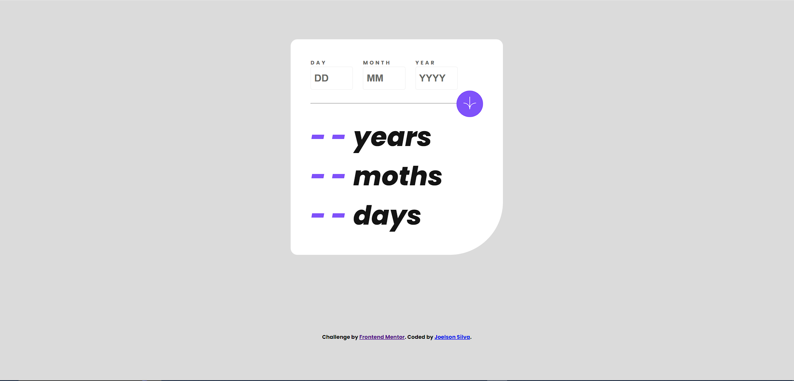
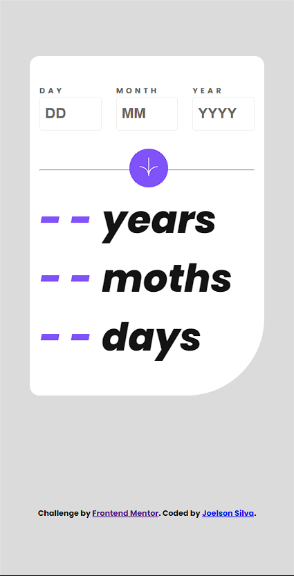

# Frontend Mentor - Age calculator app solution

This is a solution to the [Age calculator app challenge on Frontend Mentor](https://www.frontendmentor.io/challenges/age-calculator-app-dF9DFFpj-Q). Frontend Mentor challenges help you improve your coding skills by building realistic projects.

## Overview

### Screenshot




### Links

- Solution URL: [Add solution URL here](https://your-solution-url.com)

## My process

### Built with

- Semantic HTML5 markup
- CSS custom properties
- Flexbox
- CSS Grid
- Mobile-first workflow

### What I learned

funções de Date

```html
<form action="" id="form">
  <div class="formInputs">
    <div class="labelInput">
      <label for="day" class="error">DAY</label
      ><input type="number" name="day" id="inputDay" placeholder="DD" />
      <small class="inputErrorMessage"></small>
    </div>
    <div class="labelInput">
      <label for="month" class="error">MONTH</label
      ><input type="number" name="month" id="inputMonth" placeholder="MM" />
      <small class="inputErrorMessage"></small>
    </div>
    <div class="labelInput">
      <label for="year" class="error">YEAR</label
      ><input type="number" name="year" id="inputYear" placeholder="YYYY" />
      <small class="inputErrorMessage"></small>
    </div>
  </div>
  <div class="back-btn">
    <hr />
    <button type="submit">
      
    </button>
  </div>
</form>
```

```css
.proud-of-this-css {
  .container {
    background-color: var(--white);
    display: grid;
    align-items: center;
    padding: 3rem;
    border: none;
    border-radius: 1rem;
    border-bottom-right-radius: 8rem;
    width: 32rem;
  }

  .container .formInputs {
    width: 100%;
    display: flex;
    justify-content: start;
    align-items: center;
    gap: 1.5rem;
    position: relative;
  }

  .container .formInputs .labelInput {
    display: flex;
    flex-direction: column;
    justify-content: center;
  }

  .container .formInputs .labelInput label {
    font-size: 0.8rem;
    font-weight: 400;
    letter-spacing: 4px;
    color: var(--smokey-grey);
  }
}
```

### Continued development

Especilizando-se em Reactjs e Web3

## Author

- Website - [Joelson Silva](https://joelson-portfollio.vercel.app/)
- Frontend Mentor - [@JoeSeraphy](https://www.frontendmentor.io/profile/JoeSeraphy)
